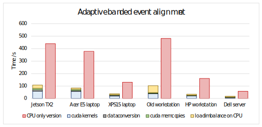
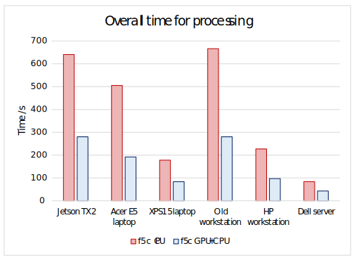
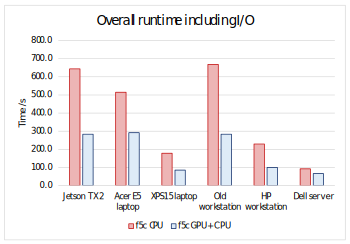

We tested on a variety of different systems (covering embedded systems, laptops, workstations and servers - table below) for comparing the performance of f5c CPU version with the GPU accelerated version.

|   System   name   |                 Info                |                   CPU                   | CPU   cores/threads |   RAM  |       GPU      |    GPU memory   |
|:-----------------:|:-----------------------------------:|:---------------------------------------:|:-------------------:|:------:|:--------------:|:---------------:|
| Jetson TX2        | NVIDIA Jetson TX2   embedded module | ARMv8 ARM Cortex-A57   + NVIDIA Denver2 | 6/6                 | 8 GB   | Tegra          | shared with RAM |
| Acer E5 laptop    | Acer F5-573G                        | i7-7500U                                | 2/4                 | 8 GB   | Gefore 940M  | 4 GB            |
| XPS15 laptop      | Dell XPS 15   laptop                | i7-8750H                                | 6/12                | 16 GB  | Gefore 1050 Ti   | 4 GB            |
| Old   workstation | Unbranded Workstation               | i7-6700K                                | 4/8                 | 32 GB  | Tesla C2075    | 6 GB            |
| HP workstation    | HP Z640 workstation                 | Xeon E5-1630                            | 4/8                 | 32 GB  | Kepler K40     | 12 GB           |
| Dell server       | Dell server                         | Xeon Silver 4114                        | 20/40               | 376 GB | Tesla V100     | 16 GB           |

## Speedup of adaptive banded event alignment

Adaptive banded event alignment algorithm consumed a vast majority of ~70% runtime of the whole methylation calling processing when run on CPU. Hence, as the first step we decided to offload this alignment process to the GPU. In order to maximise the benefit, we follow a heterogenous approach in our GPU accelerated version - both the CPU and the GPU are simultaneously utilised. The performance of adaptive banded alignment are below.

## Overall speedup of processing (excluding I/O)

The overall performance for the whole methylation calling process (not including I/O) is as below.

## Overall speedup (including I/O)

The overall performance for the whole methylation calling process (including I/O) is as below.

*Note that the speed up for the overall speedup for the Dell server was limited by slow fast5 I/O compared to the processing capability of the Tesla V100.*

Note : In all cases the programs were executed with maximum number of hardware threads supported by the CPU of the particular system. The small chr20 dataset (total ~150M bases with ~20K reads) was used.

Acknowledgement : Thanks [@GPrathap](https://github.com/GPrathap) for running the experiments on the Acer laptop.
