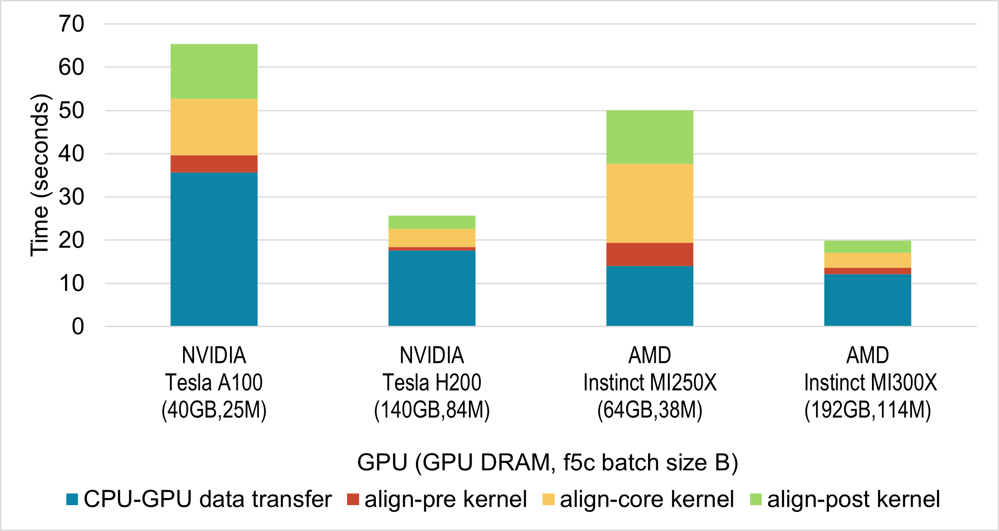
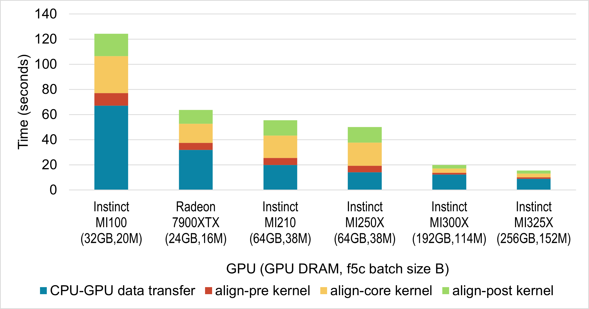
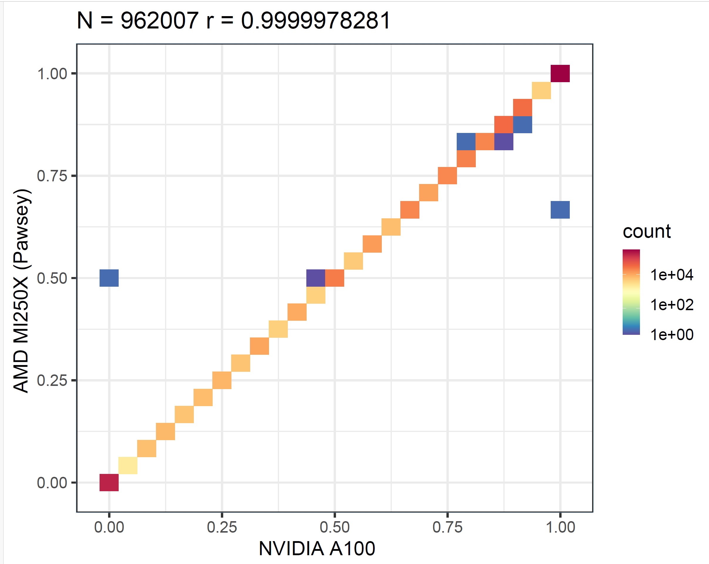

# Enabling f5c on AMD GPUs

In 2020 we released f5c, an optimised tool for aligning raw nanopore data to reference kmers and detecting methylated cytosine modified bases. The main bottleneck of performing these computations lies in the computationally intensive step of aligning raw nanopore signal data to a biological reference sequence. In f5c, this is done with the Adaptive Banded Event Alignment (ABEA) algorithm, which aligns signal “events” (segments of signal) to k-mers of a read/reference in signal-space. f5c accelerates this step through a heterogenous CPU-GPU setup, [enabling ABEA to run 3–5× faster](https://bmcbioinformatics.biomedcentral.com/articles/10.1186/s12859-020-03697-x) compared to CPU-only execution.

GPU acceleration in f5c for NVIDIA devices is enabled by compute kernels implemented using CUDA C. Now, as f5c has become a well-established component of many bioinformatics workflows, we are excited to announce AMD GPU support starting from version 1.6, implemented using HIP C.


## Runtime Performance

Now, let us examine how the GPU-accelerated component of f5c (the ABEA algorithm) performs on AMD GPUs. For this evaluation, we ran f5c v1.6 on a dataset consisting of approximately 200,000 nanopore reads (chr22 reads extracted from the PGXXXX230339 sample in [https://gentechgp.github.io/gtgseq/docs/data.html](https://gentechgp.github.io/gtgseq/docs/data.html).

We conducted experiments on two NVIDIA GPUs (A100 and H200) and two AMD GPUs (MI250X and MI300X). Figure below shows the time spent on the ABEA algorithm on GPU, including CPU–GPU data transfer. The figure breaks down the timing for the three GPU kernels (align-pre, align-core, and align-post), which implement the ABEA algorithm, as well as the time required to copy data between CPU and GPU.

In all cases, we executed f5c using the maximum batch size (B) that fully utilised the available GPU DRAM. The DRAM available on those GPUs and the selected batch size used for each GPU are indicated in Figure below.



While GPUs are not directly comparable due to differences in hardware, here we see that performance on AMD GPUs is comparable  to equivalent NVIDIA GPUs.

Next, we evaluated the performance of the f5c ABEA GPU implementation across a range of AMD GPUs. For this, we used systems available to us, which included five server-grade Instinct GPUs and one gaming-class Radeon GPU. The results are presented in Figure below. As before, we selected the batch size to fully utilise the available GPU memory; the specific batch size for each GPU is indicated in Figure below.



# Accuracy

Next, we validate the accuracy of the results. Due to factors such as floating-point approximations, we do not expect identical outputs across different hardware. Therefore, our evaluation approach is to run the f5c call-methylation program (which uses ABEA as one of its components) and then generate a correlation plot from its output. We first execute the program solely on the CPU, and then repeat the process on both an NVIDIA GPU and an AMD GPU. As shown in the methylation correlation plots in Figure below, the correlation between NVIDIA A100 and CPU (first panel) is nearly the same as that between AMD MI250X and CPU (second panel). This demonstrates that the results produced by AMD GPUs are as accurate as those from NVIDIA GPUs.


We then generated a correlation plot comparing the results from the AMD MI250X and the NVIDIA A100 GPUs, as shown in the figure below. This correlation is even stronger than what we observe between either GPU and the CPU.



## Running f5c on AMD GPUs

Now that we have confirmed both performance and accuracy, you might be wondering how to run f5c on your AMD GPUs. The simplest approach is to use the pre-compiled binary available under [releases](https://github.com/hasindu2008/f5c/releases). At the time of writing, the latest version is f5c v1.6, which you can install and run a test by following the commands provided below.

```bash
wget https://github.com/hasindu2008/f5c/releases/download/v1.6/f5c-v1.6-rocm-binaries-experimental.tar.gz && tar xf f5c-v1.6-rocm-binaries-experimental.tar.gz
cd f5c-v1.6 && mv f5c_x86_64_linux_rocm f5c
scripts/test.sh
```

These f5c v1.6 AMD binaries require GLIBC ≥ 2.27 and a GPU driver compatible with the included ROCm runtime (v5.7). We have embedded fat binaries for a range of AMD GPUs supported by the hipcc compiler included with ROCm 5.7. If your GPU is not amongst the embedded fat binaries, the precompiled f5c program may give a runtime error. In that case, you can build f5c with AMD GPU support from source, available at https://github.com/hasindu2008/f5c. Please refer to the README in the repository for detailed compilation instructions.

## Acknowledgements

The implementation that enabled AMD GPU support for f5c was initiated during the CSC/Pawsey Hackathon held in September 2025 in Finland. We would like to thank the event organisers (CSC and Pawsey Supercomputing Centres) as well as the mentors who provided invaluable support throughout the hackathon.
