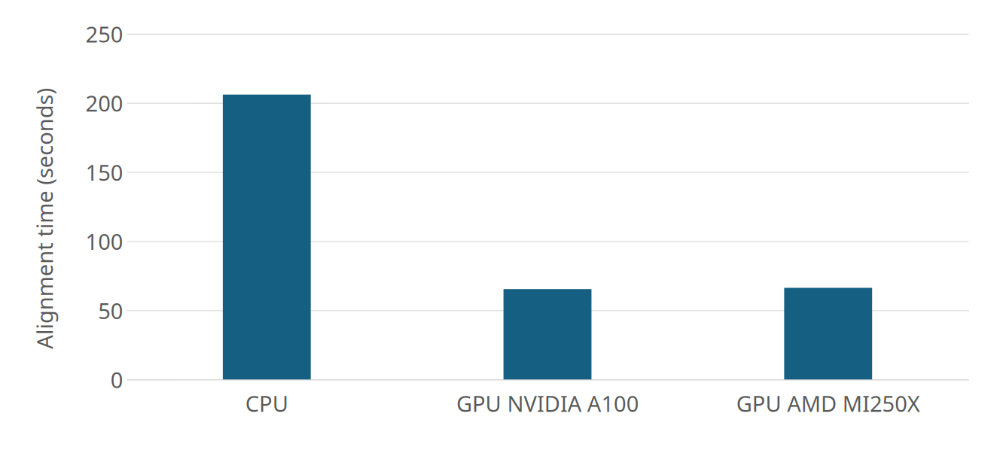
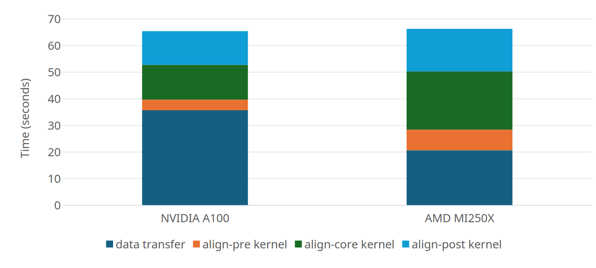
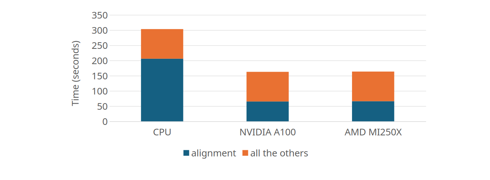
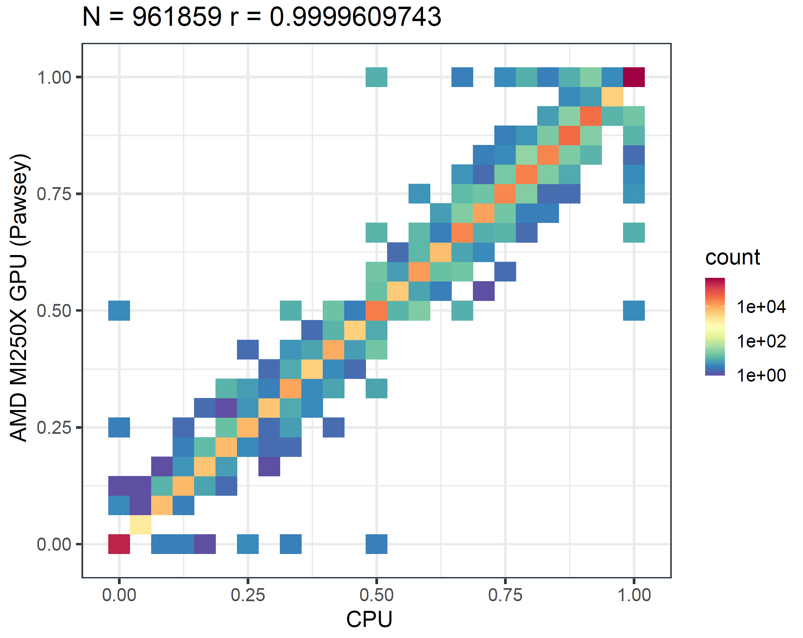
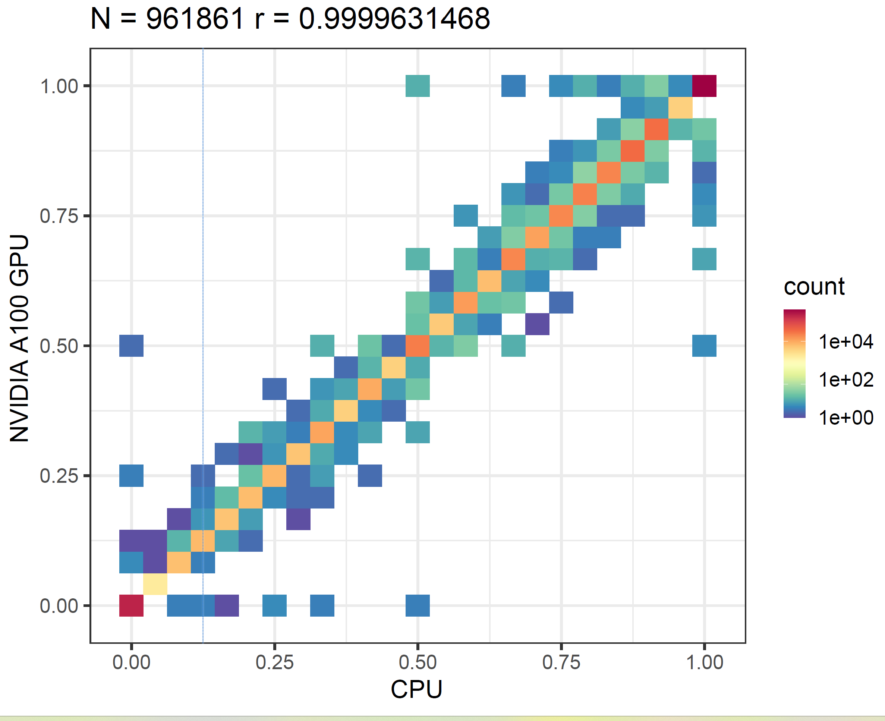

# Enabling f5c on AMD GPUs
 

<!--

Background

Nanopore, now a popular part of genomics sequencing technology, has become the gold standard for portable, accurate, and cost-effective DNA analysis. These attributes, and it's success in real-time in-the-field sequencing has led to adoption in clinical studies, foresniscs, evolutionary biology, and life sciences.

The high volume and throughput of data generated from using Nanopore technology however, generally limits researchers to the hardware available to them.
Effective Nanopore signal analysis in these fields require the expensive process of polishing sequencing data, and detecting modified bases, such as DNA methylation. Both these processes are a non-trivial computational tasks that require an efficient use of resources.

To address these challenges facing researchers. -->

In 2020 we released f5c, an optimised tool for aligning raw nanopore data to reference kmers and detecting methylated cytosine modified bases. The main bottleneck of performing these computations lies in the comutationally intensive step of aligning raw nanopore signal data to a biological reference sequence. In f5c, this is done with the Adaptive Banded Event Alignment (ABEA) algorithm, which aligns signal “events” (segments of signal) to k-mers of a read/reference in signal-space. f5c accelerates this step through a heterogenous CPU-GPU setup, [enabling ABEA to run 3–5× faster](https://bmcbioinformatics.biomedcentral.com/articles/10.1186/s12859-020-03697-x) compared to CPU-only execution. f5c was originally introduced for NVIDIA GPUs. Now that it's a well-established part of many bioninformatic workflows, we are happy to introduce AMD GPU support for f5c.

## Results

TODO: results

## Conclusion

TODO: wider ecosystem implications

TODO: future work
