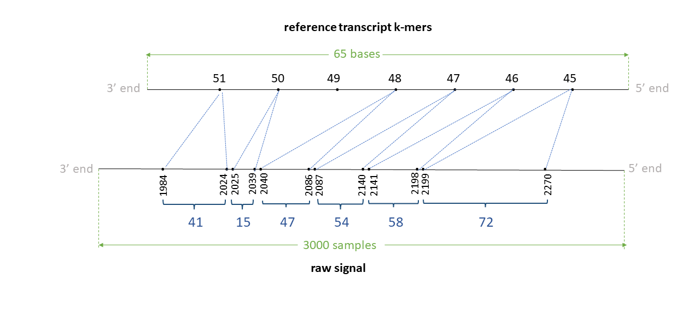

# eventalign output

## eventalign tsv output

The default TSV output is as below:

|Col|Type  |Name |Description                               |
|--:|:----:|:----|:-----------------------------------------|
|1  |string|contig|Contig on the reference which the read maps to                       |
|2  |int   |position|Start index on the contig (0-based; BED-like; closed)                    |
|3  |string   |reference_kmer|The k-mer on the reference   |
|4  |int   |read_index|Index in the BAM file for the coresponding read (0-based)       |
|5  |char  |strand|Legacy, ignore               |
|6  |int|event_index|Index of the event on the event table (0-based; BED-like; closed)                    |
|7  |float   |event_level_mean|Mean level of the current values of the event                   |
|8  |float   |event_stdv| Standard deviation of the current values of the event  |
|9  |float   |event_length| Length of the event (in seconds)   |
|10 |int   |model_kmer|The k-mer on the pore-model which this event matched                   |
|11 |int   |model_mean|Scaled mean level on the pore-model for the matched k-mer *(scaling.scale * level_mean + scaling.shift)* where *level_mean* in the first column in the pore-model                   |
|12 |int   |model_stdv|Scaled standard deviation on the pore-model for the matched k-mer *(level_stdv * scaling.var)* where *level_stdv* in the second column in the pore-model |
|13 |int   |standardized_level|*(event_level_mean - model_mean) / (sqrt(scalings.var) * model_stdv)*  |


Command line options can be used to modify default columns or print additional columns. `--samples` will print two additional columns, namely start_idx and end_idx. 

Following optional columns are controlled via command line options:
|Command_line_Option|Type  |Name |Description                               |
|:----------|:----|:----|:-----------------------------------------|
|`--print-read-name`|string|read_name|Column 4 will become read_name that prints the read ID|
|`--signal-index`   |int   |start_idx|start_idx is the starting index on the raw signal which the corresponding k-mer maps to (0-based; BED-like; closed)|
|`--signal-index`   |int   |end_idx  |end_idx is the ending index on the raw signal which the corresponding k-mer maps to (0-based; BED-like; open)|
|`--scale-events`   |float |event_level_mean| Intead of scaling the model to the events, now events will be scaled to the model. column 7 becomes `(event_level_mean-scaling.shift)/scaling.scale`|
|`--scale-events`   |float |model_mean| Intead of scaling the model to the events, now events will be scaled to the model. column 11 becomes *level_mean* (*level_mean* is the first column in the pore model)|
|`--scale-events`   |float |model_stdv| Intead of scaling the model to the events, now events will be scaled to the model. column 12 becomes *level_stdv* (*level_stdv* is the second column in the pore model)|
|`--samples`        |float,float,...|samples|  Prints the comma separated signal samples corresponding to the mapped k-mer (scaled pA current values). `scaled pA current values = (pA - scaling.shift) / scaling.scale` where `pA = (raw_signal + offset) * range / digitisation`|

## eventalign paf output

Specifying `-c` will generate the output in a PAF-like format (much smaller than the TSV output, f5c v1.3 or higher). This is similar to the PAF output format in [f5c resquiggle](https://hasindu2008.github.io/f5c/docs/output#resquiggle-paf-output-format) with major difference being that the "basecalled read" in resquiggle is now the "refererence sequence" in eventalign. Assumming that the reader is well familiarised with the PAF output explained in resquiggle, that information is not repeated here, instead only a summary is given. Unlike in resquiggle, the strand column (column 5) can be now both '+' and '-'.  The query is the raw-signal and the target is the reference.

|Col|Type  |Name |Description                               |
|--:|:----:|:----|:-----------------------------------------|
|1  |string|read_id|Read identifier name                       |
|2  |int   |len_raw_signal|Raw signal length (number of samples)                    |
|3  |int   |start_raw|Raw signal start index  (0-based; BED-like; closed)   |
|4  |int   |end_raw|Raw signal end index (0-based; BED-like; open)       |
|5  |char  |strand|Relative strand: "+" or "-"               |
|6  |string|read_id|Reference sequence name                     |
|7  |int   |len_kmer|Reference sequence length (no. of k-mers)                   |
|8  |int   |start_kmer| k-mer start index on reference sequence (0-based; see note below)  |
|9  |int   |end_kmer| k-mer end index on sequence sequence (0-based; see note below)   |
|10 |int   |matches|Number of k-mers matched on reference sequence                   |
|11 |int   |len_block|Number of k-mers on the mapped segment on reference sequence                    |
|12 |int   |mapq|Mapping quality (0-255; 255 for missing)  |

For DNA reads, column 8 is a closed coordinate (inclusive) and column 9 is an open coordinate (not-inclusive); and, column 8 coordinate is always smaller than column 9. However, this is different in direct-RNA reads because sequencing of direct-RNA happens in the reverse direction (3'->5') and therefore the raw signal is also in the reverse direction. The sequences in the reference transcriptome are however in the correct direction (5'->3'). Thus, For RNA reads, column 8 coordinate will be larger than that on column 9. column 9 is a closed coordinate (inclusive) while column 8 is an open coordinate (not-inclusive) in this case, in contrary to DNA.

10,11 and 12 are yet to be decided. column 12 is always 255 for now.

Following optional tags are present:

|Tag|Type  |Description                               |
|--:|:----:|:-----------------------------------------|
|sc  |f| Post alignment recalibrated scale parameter                     |
|sh  |f   |Post alignment recalibrated shift parameter                      |
|ss  |Z   |signal alignment string in format described below   |

Please refer to the explanations in [f5c resquiggle](https://hasindu2008.github.io/f5c/docs/output#resquiggle-paf-output-format) about the ss tag. Some examples are given below.

## DNA examples

### Positive strand

Assume we have a read signal named rid0 of 1000 signal samples, mapped to a reference contig named ctg0 of 35 bases Assume a k-mer size of 6. We have a total of 30 k-mers in the reference. Assume the signal-reference alignment looks like in teh figure below. Assume that the 12-24th bases (0-index; bed-like) inthis contig are `TTGATGGTGGAA`. Thus, 12th kmer is TTGATG, 13th k-mer is TGATGG, 14th k-mer is GATGGT, .. and the 18th k-mer is GTGGAA.


The tsv output from resquiggle will look like below (assume `--print-read-name` and `--signal-index are provided`):

|contig	|position	|reference_kmer	|read_id	|strand	|event_index	|event_level_mean	|event_stdv	|event_length	|model_kmer	|model_mean	|model_stdv	|standardized_level	|start_idx	|end_idx|
|:----	|:----	|:----	|:----	|:----	|:----	|:----	|:----	|:----	|:----	|:----	|:----	|:----	|:----	|:----|
|ctg0|12|TTGATG|rid0|t|50|77.39|1.226|0.00150|TTGATG|68.19|3.20|2.64|265|271 |
|ctg0|12|TTGATG|rid0|t|51|85.51|1.016|0.00125|NNNNNN|0.00|0.00|inf|271|276   |
|ctg0|12|TTGATG|rid0|t|52|87.75|1.029|0.00125|NNNNNN|0.00|0.00|inf|276|281   |
|ctg0|14|GATGGT|rid0|t|53|94.90|1.399|0.00100|GATGGT|99.32|3.48|-1.17|281|285|
|ctg0|14|GATGGT|rid0|t|54|91.33|1.452|0.00075|GATGGT|99.32|3.48|-2.11|285|288|
|ctg0|14|GATGGT|rid0|t|55|93.10|0.863|0.00150|GATGGT|99.32|3.48|-1.64|288|294|
|ctg0|15|ATGGTG|rid0|t|56|76.79|1.980|0.00075|ATGGTG|76.10|4.06|0.16|294|297 |
|ctg0|15|ATGGTG|rid0|t|57|71.11|1.023|0.00100|ATGGTG|76.10|4.06|-1.13|297|301|
|ctg0|16|TGGTGG|rid0|t|58|63.34|3.575|0.00125|TGGTGG|64.60|2.53|-0.46|301|306|
|ctg0|17|GGTGGA|rid0|t|59|94.76|2.090|0.00175|GGTGGA|94.13|3.39|0.17|306|313 |
|ctg0|18|GTGGAA|rid0|t|60|78.95|1.436|0.00100|GTGGAA|80.55|3.83|-0.38|313|317|


The paf output from eventalign will look like below (the header is not present in the actual output):

|read_id|len_raw_signal|start_raw|end_raw|strand|ref_id|len_kmer|start_kmer|end_kmer|matches|len_block|mapq| |
|--:|----:|----:|--------:|--:|----:|----:|--------:|--:|----:|----:|--------:|--:|
|rid0   |1000            |265        |317     |+     |ctg0   | 30      |12         |19       | 6    |7      |255 |`ss:Z:16,1D13,7,5,7,4,` |

<!--
cmd: ./f5c eventalign -b test/chr22_meth_example/reads.sorted.bam -g test/chr22_meth_example/humangenome.fa -r test/chr22_meth_example/reads.fastq -t 16 -K 256 -B 2M --print-read-name --signal-index --slow5 test/chr22_meth_example/reads.blow5 | grep f81713d0-6ac4-41cf-947e-7fe12de2e863 
!-->

### Negative strand

Assume we have a read signal named rid1 of 1000 signal samples, mapped to a reference contig named ctg0 of 35 bases Assume a k-mer size of 6. We have a total of 30 k-mers in the reference. Assume the signal-reference alignment looks like in the figure below (note: indices in illustration denote the actual index in the + strand of the reference genome in 5’->3’ direction). 


Assume that the 11-24th bases (0-index; bed-like) in this contig are ATTGATGGTGGAA. Thus, 11th kmer is ATTGAT, 12th k-mer is TTGATG, 13th k-mer is TGATGG, .. 17th k-mer is GGTGGA and the 18th k-mer is GTGGAA.

Th negative strand is like:
```
5' ATTGATGGTGGAA 3' + strand
   |||||||||||||
3' TAACTACCACCTT 5' - strand
```

The Reverse complement is thus TTCCACCATCAAT. The 11th k-mer ATTGAT in the + strand relates to ATCAAT in the - strand,  12th k-mer TTGATG relates to CATCAA, 13th k-mer TGATGG relates to CCATC ,... , 17th k-mer GGTGGA relates to TCCACC  and 18th k-mer GTGGAA relates to TTCCAC.

The tsv output from resquiggle will look like below (assume `--print-read-name` and `--signal-index are provided`):

|contig	|position	|reference_kmer	|read_id	|strand	|event_index	|event_level_mean	|event_stdv	|event_length	|model_kmer	|model_mean	|model_stdv	|standardized_level	|start_idx	|end_idx|
|:----	|:----	|:----	|:----	|:----	|:----	|:----	|:----	|:----	|:----	|:----	|:----	|:----	|:----	|:----|
|ctg0|11|ATTGAT|rid1|t|216|80.09|0.969|0.00150|NNNNNN|0.00 |0.00|inf	|723|729|
|ctg0|13|TGATGG|rid1|t|215|78.14|0.577|0.00100|CCATCA|75.83|2.68|0.79	|719|723|
|ctg0|13|TGATGG|rid1|t|214|74.39|1.898|0.00075|CCATCA|75.83|2.68|-0.49	|716|719|
|ctg0|14|GATGGT|rid1|t|213|86.91|2.630|0.00200|ACCATC|86.41|2.16|0.21	|708|716|
|ctg0|15|ATGGTG|rid1|t|212|93.88|1.184|0.00150|CACCAT|97.64|2.26|-1.52	|702|708|
|ctg0|15|ATGGTG|rid1|t|211|99.83|1.552|0.00125|CACCAT|97.64|2.26|0.88	|697|702|
|ctg0|15|ATGGTG|rid1|t|210|98.60|0.511|0.00075|CACCAT|97.64|2.26|0.39	|694|697|
|ctg0|15|ATGGTG|rid1|t|209|99.54|1.254|0.00225|CACCAT|97.64|2.26|0.77	|685|694|
|ctg0|15|ATGGTG|rid1|t|208|97.82|1.226|0.00075|CACCAT|97.64|2.26|0.07	|682|685|
|ctg0|15|ATGGTG|rid1|t|207|99.46|0.562|0.00100|CACCAT|97.64|2.26|0.73	|678|682|
|ctg0|15|ATGGTG|rid1|t|206|98.85|0.916|0.00125|CACCAT|97.64|2.26|0.49	|673|678|
|ctg0|16|TGGTGG|rid1|t|205|86.25|1.327|0.00100|CCACCA|85.37|1.55|0.52	|669|673|
|ctg0|17|GGTGGA|rid1|t|204|86.88|1.283|0.00075|TCCACC|87.17|1.76|-0.15	|666|669|
|ctg0|17|GGTGGA|rid1|t|203|85.62|0.589|0.00075|TCCACC|87.17|1.76|-0.81	|663|666|
|ctg0|18|GTGGAA|rid1|t|202|90.79|1.335|0.00075|TTCCAC|91.76|1.96|-0.45	|660|663|

<!--
./f5c eventalign -b test/chr22_meth_example/reads.sorted.bam -g test/chr22_meth_example/humangenome.fa -r test/chr22_meth_example/reads.fastq -t 16 -K 256 -B 2M --print-read-name --signal-index --slow5 test/chr22_meth_example/reads.blow5 | grep 5831b66f-83e8-4d75-a576-0f75ba6a7f64
-->

The paf output from eventalign will look like below (the header is not present in the actual output):

|read_id|len_raw_signal|start_raw|end_raw|strand|ref_id|len_kmer|start_kmer|end_kmer|matches|len_block|mapq| |
|--:|----:|----:|--------:|--:|----:|----:|--------:|--:|----:|----:|--------:|--:|
|rid1   |1000            |660        |729     |-     |ctg0   | 30      |11         |19       | 7    |8      |255 |`ss:Z:3,6,4,35,8,7,1D6,` |

## RNA examples

### Positive strand

Assume we have a read signal named rid0 of 3000 signal samples, mapped to a reference transcript (or can be a ctg in the reference genome) named trn0 of 65 bases. Assume a k-mer size of 5. We have a total of 61 k-mers in the reference. 

Assume the signal-reference alignment looks like in the figure below. Note that the RNA is sequenced 3'->5' end, so the raw signal is 3'->5' direction. However, as transcipts in the reference are in 5'->3' direction, the transcript is reversed to be 3'->5' in the illustration (note: indices in illustration denote the actual index in the transcriptd in 5'->3' direction). 

Assume that the 45-56th bases (0-index; bed-like) in this transcript in 5'->3' direction is `GAGAGCCCTGA`. Then, 45th kmer is GAGAG, 46th k-mer is AGAGC, 47th k-mer is GAGCC, .. and the 51st k-mer is CCTGA.





The tsv output from resquiggle will look like below (assume `--print-read-name` and `--signal-index are provided`):

|contig	|position	|reference_kmer	|read_id	|strand	|event_index	|event_level_mean	|event_stdv	|event_length	|model_kmer	|model_mean	|model_stdv	|standardized_level	|start_idx	|end_idx|
|:----	|:----	|:----	|:----	|:----	|:----	|:----	|:----	|:----	|:----	|:----	|:----	|:----	|:----	|:----|
trn0|45|GAGAG|rid0|t|62|139.24|11.306|0.02390|GAGAG|140.16|10.24|-0.07|2199|2271|
trn0|46|AGAGC|rid0|t|63|141.04|11.203|0.01926|AGAGC|144.32|9.93|-0.25|2141|2199|
trn0|47|GAGCC|rid0|t|64|117.06|5.038|0.01029|GAGCC|118.37|5.26|-0.19|2110|2141|
trn0|47|GAGCC|rid0|t|65|114.03|1.993|0.00365|GAGCC|118.37|5.26|-0.62|2099|2110|
trn0|47|GAGCC|rid0|t|66|116.30|3.843|0.00398|GAGCC|118.37|5.26|-0.30|2087|2099|
trn0|48|AGCCC|rid0|t|67|132.00|1.294|0.00697|AGCCC|126.60|5.74|0.71|2066|2087|
trn0|48|AGCCC|rid0|t|68|93.27|13.847|0.00863|NNNNN|0.00|0.00|inf|2040|2066|
trn0|50|CCCTG|rid0|t|69|80.59|2.676|0.00498|CCCTG|86.42|4.10|-1.08|2025|2040|
trn0|51|CCTGA|rid0|t|70|100.31|2.563|0.00398|CCTGA|109.18|4.97|-1.35|2013|2025|
trn0|51|CCTGA|rid0|t|71|116.03|2.440|0.00631|CCTGA|109.18|4.97|1.04|1994|2013|
trn0|51|CCTGA|rid0|t|72|101.67|1.433|0.00332|CCTGA|109.18|4.97|-1.14|1984|1994|


The paf output from eventalign will look like below (the header is not present in the actual output):

|read_id|len_raw_signal|start_raw|end_raw|strand|ref_id|len_kmer|start_kmer|end_kmer|matches|len_block|mapq| |
|--:|----:|----:|--------:|--:|----:|----:|--------:|--:|----:|----:|--------:|--:|
|rid0   |3000            |1984        |2271     |+     |trn0   | 61      |52         |45       | 6    |7      |255 |`ss:Z:41,15,1D47,54,58,72,` |

Note that start_kmer and end_kmer are otherway round compared to DNA.

<!--
./f5c eventalign -b test/rna/reads.sorted.bam -g test/rna/gencode.v35.transcripts.fa -r test/rna/reads.fastq -t 16 -K 256 -B 2M --summary test/rna/f5c_event_align.summary.txt  --rna --signal-index --print-read-name | grep cf78b09c-cb53-4631-8bef-a98b344d67c3
!-->


### Negative strand

Assume we have a read signal named rid1 of 500 signal samples, mapped to a reference contig named ctg1 of 20 bases. Assume a k-mer size of 5. We have a total of 24 k-mers in the reference. Assume the signal-reference alignment looks like in the figure below (note: indices in illustration denote the actual index in the + strand of the reference genome in 5’->3’ direction). 


Assume that the 4-13th bases (0-index; bed-like) in this contig are AAATGGCTGA. Thus, 4th kmer is AAATG, 5th k-mer is AATGG, .. 8th k-mer is GGCTG and the 9th k-mer is GCTGA.

Th negative strand is like:
```
5' AAATGGCTGA 3' + strand
   ||||||||||
3' TTTACCGACT 5' - strand
```

The Reverse complement is thus TCAGCCATTT. The 4th k-mer AAATG in the + strand relates to CATTT in the - strand,  5th k-mer AATGG relates to CCATT ,... , 8th k-mer GGCTG relates to CAGCC and 9th k-mer GCTGA relates to TCAGC.

The tsv output from resquiggle will look like below (assume `--print-read-name` and `--signal-index are provided`):

|contig	|position	|reference_kmer	|read_id	|strand	|event_index	|event_level_mean	|event_stdv	|event_length	|model_kmer	|model_mean	|model_stdv	|standardized_level	|start_idx	|end_idx|
|:----	|:----	|:----	|:----	|:----	|:----	|:----	|:----	|:----	|:----	|:----	|:----	|:----	|:----	|:----|
|ctg1|4|AAATG|rid1|t|14|100.70|2.678|0.00664|CATTT|100.40|6.94|0.04|61|81|
|ctg1|5|AATGG|rid1|t|13|96.55|4.060|0.00432|CCATT|98.42|2.68|-0.62|81|94|
|ctg1|6|ATGGC|rid1|t|12|83.36|1.416|0.00332|GCCAT|84.06|2.64|-0.24|94|104|
|ctg1|6|ATGGC|rid1|t|11|87.00|6.172|0.00299|GCCAT|84.06|2.64|0.99|104|113|
|ctg1|7|TGGCT|rid1|t|10|121.45|4.970|0.00598|AGCCA|121.42|4.13|0.01|113|131|
|ctg1|7|TGGCT|rid1|t|9|128.10|1.094|0.00299|AGCCA|121.42|4.13|1.44|131|140|
|ctg1|7|TGGCT|rid1|t|8|124.88|4.039|0.00631|AGCCA|121.42|4.13|0.75|140|159|
|ctg1|8|GGCTG|rid1|t|7|115.80|2.588|0.00465|CAGCC|115.81|3.78|-0.00|159|173|
|ctg1|8|GGCTG|rid1|t|6|111.04|2.482|0.00332|CAGCC|115.81|3.78|-1.13|173|183|
|ctg1|9|GCTGA|rid1|t|5|99.95|2.843|0.00498|TCAGC|101.66|6.39|-0.24|183|198|

The paf output from eventalign will look like below (the header is not present in the actual output):

|read_id|len_raw_signal|start_raw|end_raw|strand|ref_id|len_kmer|start_kmer|end_kmer|matches|len_block|mapq| |
|--:|----:|----:|--------:|--:|----:|----:|--------:|--:|----:|----:|--------:|--:|
|rid1   |500            |61        |198     |-     |ctg1   | 24      |10         |4       | 6    |6      |255 |`ss:Z:20,13,19,46,24,15,` |

<!--

negative 
./f5c eventalign -b test/rna/reads.sorted.bam -g test/rna/gencode.v35.transcripts.fa -r test/rna/reads.fastq -t 16 -K 256 -B 2M --summary test/rna/f5c_event_align.summary.txt  --rna --signal-index --print-read-name | grep 29192917-7793-4f78-b079-c7aa3f24992e

ctg1	4	AAATG	rid1	t	584	100.70	2.678	0.00664	CATTT	100.40	6.94	0.04	11061	11081
ctg1	5	AATGG	rid1	t	583	96.55	4.060	0.00432	CCATT	98.42	2.68	-0.62	11081	11094
ctg1	6	ATGGC	rid1	t	582	83.36	1.416	0.00332	GCCAT	84.06	2.64	-0.24	11094	11104
ctg1	6	ATGGC	rid1	t	581	87.00	6.172	0.00299	GCCAT	84.06	2.64	0.99	11104	11113
ctg1	7	TGGCT	rid1	t	580	121.45	4.970	0.00598	AGCCA	121.42	4.13	0.01	11113	11131
ctg1	7	TGGCT	rid1	t	579	128.10	1.094	0.00299	AGCCA	121.42	4.13	1.44	11131	11140
ctg1	7	TGGCT	rid1	t	578	124.88	4.039	0.00631	AGCCA	121.42	4.13	0.75	11140	11159
ctg1	8	GGCTG	rid1	t	577	115.80	2.588	0.00465	CAGCC	115.81	3.78	-0.00	11159	11173
ctg1	8	GGCTG	rid1	t	576	111.04	2.482	0.00332	CAGCC	115.81	3.78	-1.13	11173	11183
ctg1	9	GCTGA	rid1	t	575	99.95	2.843	0.00498	TCAGC	101.66	6.39	-0.24	11183	11198

todo: Note on splice
todo: in ctual output in paf,, fix the reference contig len

!-->

## eventalign sam output

Specifying `-a` will generate the output in SAM format (much smaller than the TSV output, f5c v1.3 or higher). This output SAM file will contain following two additional tags added to the S/BAM file given as the input to f5c:

|Tag|Type  |Description                               |
|--:|:----:|:-----------------------------------------|
|si  |Z   |coordinates associated with the ss tag below (explained below)                     |
|ss  |Z   |signal alignment string in format described [here](https://hasindu2008.github.io/f5c/docs/output#resquiggle-paf-output-format)   |

*si* tag contains four comma separated values *start_raw*, *end_raw*, *start_kmer* and *end_kmer*, respectively. Those values have the same  as the columns 3,4,8 and 9 in the PAF format explained above when specified along with -c/

