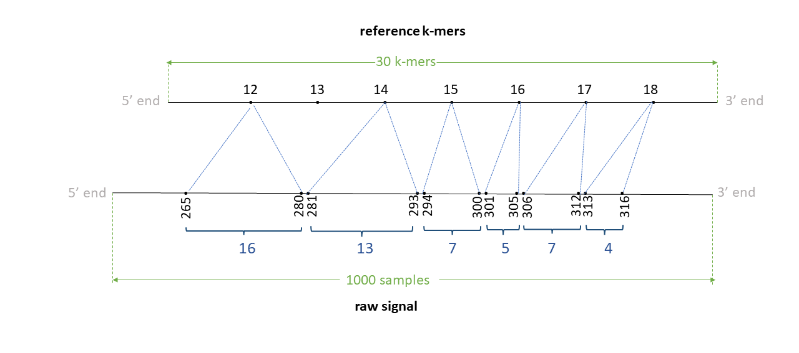
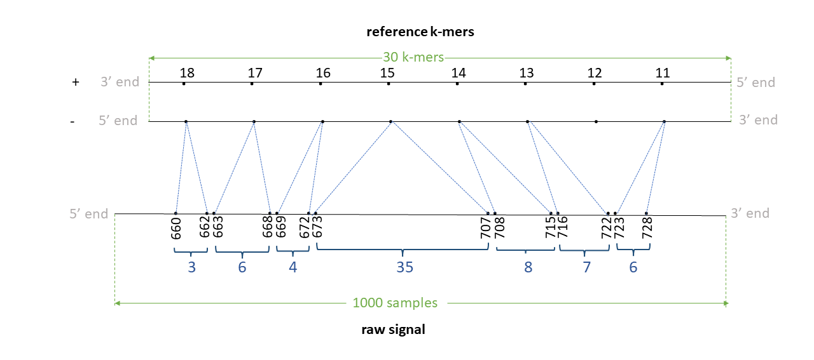

# eventalign output

## eventalign tsv output

The default TSV output is as below:

|Col|Type  |Name |Description                               |
|--:|:----:|:----|:-----------------------------------------|
|1  |string|contig|Contig on the reference which the read maps to                       |
|2  |int   |position|Start index on the contig (0-based; BED-like; closed)                    |
|3  |string   |reference_kmer|The k-mer on the reference   |
|4  |int   |read_index|Index in the BAM file for the coresponding read (0-based)       |
|5  |char  |strand|Legacy, ignore               |
|6  |int|event_index|Index of the event on the event table (0-based; BED-like; closed)                    |
|7  |float   |event_level_mean|Mean level of the current values of the event                   |
|8  |float   |event_stdv| Standard deviation of the current values of the event  |
|9  |float   |event_length| Length of the event (in seconds)   |
|10 |int   |model_kmer|The k-mer on the pore-model which this event matched                   |
|11 |int   |model_mean|Scaled mean level on the pore-model for the matched k-mer *(scaling.scale * level_mean + scaling.shift)* where *level_mean* in the first column in the pore-model                   |
|12 |int   |model_stdv|Scaled standard deviation on the pore-model for the matched k-mer *(level_stdv * scaling.var)* where *level_stdv* in the second column in the pore-model |
|13 |int   |standardized_level|*(event_level_mean - model_mean) / (sqrt(scalings.var) * model_stdv)*  |


Command line options can be used to modify default columns or print additional columns. `--samples` will print two additional columns will be printed, namely start_idx and end_idx. 

Following optional columns are controlled via command line options:
|Command_line_Option|Type  |Name |Description                               |
|:----------|:----|:----|:-----------------------------------------|
|`--print-read-name`|string|read_name|Column 4 will become read_name that prints the read ID|
|`--signal-index`   |int   |start_idx|start_idx is the starting index on the raw signal which the corresponding k-mer maps to (0-based; BED-like; closed)|
|`--signal-index`   |int   |end_idx  |end_idx is the ending index on the raw signal which the corresponding k-mer maps to (0-based; BED-like; open)|
|`--scale-events`   |float |event_level_mean| Intead of scaling the model to the events, now events will be scaled to the model. column 7 becomes `(event_level_mean-scaling.shift)/scaling.scale`|
|`--scale-events`   |float |model_mean| Intead of scaling the model to the events, now events will be scaled to the model. column 11 becomes *level_mean* (*level_mean* is the first column in the pore model)|
|`--scale-events`   |float |model_stdv| Intead of scaling the model to the events, now events will be scaled to the model. column 12 becomes *level_stdv* (*level_stdv* is the second column in the pore model)|
|`--samples`        |float,float,...|samples|  Prints the comma separated signal samples corresponding to the mapped k-mer (scaled pA current values). `scaled pA current values = (pA - scaling.shift) / scaling.scale` where `pA = (raw_signal + offset) * range / digitisation`|

## event align output

Specifying `-c` will generate the output in a PAF-like format (much smaller than the TSV output). This is almost the same as the PAF output format in f5c resquiggle with only difference being that the "basecalled read" in resquiggle is now the "refererence contig" in eventalign. Assume that the reader has well familiarised with the PAF output explained in resquiggle as those information is not repeated here. Unlike in resquiggle, the strand column (column 5) can be now both '+' and '-'. Some examples are below.

## DNA examples

### Positive strand

Assume we have a read signal named rid0 of 1000 signal samples, mapped to a reference contig named ctg0 of 35 bases Assume a k-mer size of 6. We have a total of 30 k-mers in the reference. Assume the signal-reference alignment looks like in teh figure below. Assume that the 12-24th bases (0-index; bed-like; closed) inthis contig are `TTGATGGTGGAA`. Thus, 12th kmer is TTGATG, 13th k-mer is TGATGG, 14th k-mer is GATGGT, .. and the 18th k-mer is GTGGAA.




The tsv output from resquiggle will look like below (assume `--print-read-name` and `--signal-index are provided`):

|contig	|position	|reference_kmer	|read_id	|strand	|event_index	|event_level_mean	|event_stdv	|event_length	|model_kmer	|model_mean	|model_stdv	|standardized_level	|start_idx	|end_idx|
|:----	|:----	|:----	|:----	|:----	|:----	|:----	|:----	|:----	|:----	|:----	|:----	|:----	|:----	|:----|
|ctg0|12|TTGATG|rid0|t|50|77.39|1.226|0.00150|TTGATG|68.19|3.20|2.64|265|271 |
|ctg0|12|TTGATG|rid0|t|51|85.51|1.016|0.00125|NNNNNN|0.00|0.00|inf|271|276   |
|ctg0|12|TTGATG|rid0|t|52|87.75|1.029|0.00125|NNNNNN|0.00|0.00|inf|276|281   |
|ctg0|14|GATGGT|rid0|t|53|94.90|1.399|0.00100|GATGGT|99.32|3.48|-1.17|281|285|
|ctg0|14|GATGGT|rid0|t|54|91.33|1.452|0.00075|GATGGT|99.32|3.48|-2.11|285|288|
|ctg0|14|GATGGT|rid0|t|55|93.10|0.863|0.00150|GATGGT|99.32|3.48|-1.64|288|294|
|ctg0|15|ATGGTG|rid0|t|56|76.79|1.980|0.00075|ATGGTG|76.10|4.06|0.16|294|297 |
|ctg0|15|ATGGTG|rid0|t|57|71.11|1.023|0.00100|ATGGTG|76.10|4.06|-1.13|297|301|
|ctg0|16|TGGTGG|rid0|t|58|63.34|3.575|0.00125|TGGTGG|64.60|2.53|-0.46|301|306|
|ctg0|17|GGTGGA|rid0|t|59|94.76|2.090|0.00175|GGTGGA|94.13|3.39|0.17|306|313 |
|ctg0|18|GTGGAA|rid0|t|60|78.95|1.436|0.00100|GTGGAA|80.55|3.83|-0.38|313|317|


The paf output from eventalign will look like below (the header is not present in the actual output):

|read_id|len_raw_signal|start_raw|end_raw|strand|ref_id|len_kmer|start_kmer|end_kmer|matches|len_block|mapq| |
|--:|----:|----:|--------:|--:|----:|----:|--------:|--:|----:|----:|--------:|--:|
|rid0   |1000            |265        |317     |+     |ctg0   | 30      |12         |19       | 6    |7      |255 |`ss:Z:16,1D13,7,5,7,4,` |

<!--
cmd: ./f5c eventalign -b test/chr22_meth_example/reads.sorted.bam -g test/chr22_meth_example/humangenome.fa -r test/chr22_meth_example/reads.fastq -t 16 -K 256 -B 2M --print-read-name --signal-index --slow5 test/chr22_meth_example/reads.blow5 | grep f81713d0-6ac4-41cf-947e-7fe12de2e863 
!-->

### Negative strand

Assume we have a read signal named rid1 of 1000 signal samples, mapped to a reference contig named ctg0 of 35 bases Assume a k-mer size of 6. We have a total of 30 k-mers in the reference. Assume the signal-reference alignment looks like in the figure below. 




Assume that the 11-24th bases (0-index; bed-like; closed) in this contig are ATTGATGGTGGAA. Thus, 11th kmer is ATTGAT, 12th k-mer is TTGATG, 13th k-mer is TGATGG, .. 17th k-mer is GGTGGA and the 18th k-mer is GTGGAA.

Th negative strand is like:
```
5' ATTGATGGTGGAA 3' + strand
   |||||||||||||
3' TAACTACCACCTT 5' - strand
```

The Reverse complement is thus TTCCACCATCAAT. The 11th k-mer ATTGAT in the + strand relates to ATCAAT in the - strand,  12th k-mer TTGATG relates to CATCAA, 13th k-mer TGATGG relates to CCATC ,... , 17th k-mer GGTGGA relates to TCCACC  and 18th k-mer GTGGAA relates to TTCCAC.

The tsv output from resquiggle will look like below (assume `--print-read-name` and `--signal-index are provided`):

|contig	|position	|reference_kmer	|read_id	|strand	|event_index	|event_level_mean	|event_stdv	|event_length	|model_kmer	|model_mean	|model_stdv	|standardized_level	|start_idx	|end_idx|
|:----	|:----	|:----	|:----	|:----	|:----	|:----	|:----	|:----	|:----	|:----	|:----	|:----	|:----	|:----|
|ctg0|11|ATTGAT|rid1|t|1916|80.09|0.969|0.00150|NNNNNN|0.00 |0.00|inf	|723|729|
|ctg0|13|TGATGG|rid1|t|1915|78.14|0.577|0.00100|CCATCA|75.83|2.68|0.79	|719|723|
|ctg0|13|TGATGG|rid1|t|1914|74.39|1.898|0.00075|CCATCA|75.83|2.68|-0.49	|716|719|
|ctg0|14|GATGGT|rid1|t|1913|86.91|2.630|0.00200|ACCATC|86.41|2.16|0.21	|708|716|
|ctg0|15|ATGGTG|rid1|t|1912|93.88|1.184|0.00150|CACCAT|97.64|2.26|-1.52	|702|708|
|ctg0|15|ATGGTG|rid1|t|1911|99.83|1.552|0.00125|CACCAT|97.64|2.26|0.88	|697|702|
|ctg0|15|ATGGTG|rid1|t|1910|98.60|0.511|0.00075|CACCAT|97.64|2.26|0.39	|694|697|
|ctg0|15|ATGGTG|rid1|t|1909|99.54|1.254|0.00225|CACCAT|97.64|2.26|0.77	|685|694|
|ctg0|15|ATGGTG|rid1|t|1908|97.82|1.226|0.00075|CACCAT|97.64|2.26|0.07	|682|685|
|ctg0|15|ATGGTG|rid1|t|1907|99.46|0.562|0.00100|CACCAT|97.64|2.26|0.73	|678|682|
|ctg0|15|ATGGTG|rid1|t|1906|98.85|0.916|0.00125|CACCAT|97.64|2.26|0.49	|673|678|
|ctg0|16|TGGTGG|rid1|t|1905|86.25|1.327|0.00100|CCACCA|85.37|1.55|0.52	|669|673|
|ctg0|17|GGTGGA|rid1|t|1904|86.88|1.283|0.00075|TCCACC|87.17|1.76|-0.15	|666|669|
|ctg0|17|GGTGGA|rid1|t|1903|85.62|0.589|0.00075|TCCACC|87.17|1.76|-0.81	|663|666|
|ctg0|18|GTGGAA|rid1|t|1902|90.79|1.335|0.00075|TTCCAC|91.76|1.96|-0.45	|660|663|

<!--
./f5c eventalign -b test/chr22_meth_example/reads.sorted.bam -g test/chr22_meth_example/humangenome.fa -r test/chr22_meth_example/reads.fastq -t 16 -K 256 -B 2M --print-read-name --signal-index --slow5 test/chr22_meth_example/reads.blow5 | grep 5831b66f-83e8-4d75-a576-0f75ba6a7f64
-->

The paf output from eventalign will look like below (the header is not present in the actual output):

|read_id|len_raw_signal|start_raw|end_raw|strand|ref_id|len_kmer|start_kmer|end_kmer|matches|len_block|mapq| |
|--:|----:|----:|--------:|--:|----:|----:|--------:|--:|----:|----:|--------:|--:|
|rid1   |1000            |660        |729     |-     |ctg0   | 30      |11         |19       | 7    |8      |255 |`ss:Z:3,6,4,35,8,7,1D6,` |

## RNA examples

    

