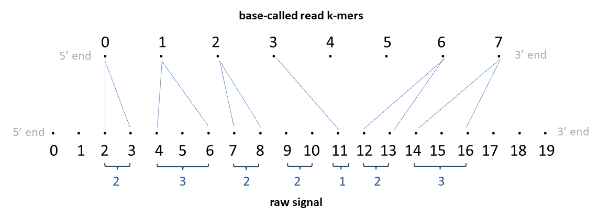

# Output

## resquiggle

f5c resquiggle aligns raw signals to basecalled reads. f5c resquiggle output is explained below. Note that resquiggle is under development, the output format is a draft and may change in the future versions. When it is stable, this notice will be removed.

The default output is an intuitive TSV format with the following columns.

|Col|Type  |Name            |Description                                                            |
|--:|:----: |:------:        |:-----------------------------------------                             |
|1  |string|read_id         |Read identifier name                                                   |
|2  |int    |kmer_idx  |k-mer index on the basecalled read (0-based)                               |
|3  |int    |start_raw_idx     |Raw signal start index for the corresponding k-mer (0-based; BED-like; closed)                                  |
|4  |int    |end_raw_idx       |Raw signal end index for the corresponding k-mer (0-based; BED-like; open)                                   |

If a corresponding base has no corresponding signal samples, a `.` will be printed.

The above output is bulky. Specifying `-c` will produce a condensed output in PAF-like format (inspired by [UNCALLED](https://github.com/skovaka/UNCALLED)) with the following columns:
The query is the raw-signal and the target is the basecalled-read.

|Col|Type  |Name |Description                               |
|--:|:----:|:----|:-----------------------------------------|
|1  |string|read_id|Read identifier name                       |
|2  |int   |len_raw_signal|Raw signal length (number of samples)                    |
|3  |int   |start_raw|Raw signal start index  (0-based; BED-like; closed)   |
|4  |int   |end_raw|Raw signal end index (0-based; BED-like; open)       |
|5  |char  |strand|Relative strand: "+" or "-"               |
|6  |string|read_id|Same as column 1                     |
|7  |int   |len_kmer|base-called sequence length (no. of k-mers)                   |
|8  |int   |start_kmer| k-mer start index on basecalled sequence (0-based; see note below)  |
|9  |int   |end_kmer| k-mer end index on basecalled sequence (0-based; see note below)   |
|10 |int   |matches|Number of k-mers matched on basecalled sequence                   |
|11 |int   |len_kmer|Same as column 7                    |
|12 |int   |mapq|Mapping quality (0-255; 255 for missing)  |

For DNA reads, column 8 is a closed coordinate (inclusive) and column 9 is an open coordinate (not-inclusive); and, column 8 coordinate is always smaller than column 9. However, this is different in direct-RNA reads because sequencing of direct-RNA happens in the reverse direction (3'->5') and therefore the raw signal is also in the reverse direction. The basecalled read output by basecallers are however in the correct direction (5'->3'). Thus, For RNA reads, column 8 coordinate will be larger than that on column 9. column 9 is a closed coordinate (inclusive) while column 8 is an open coordinate (not-inclusive) in this case, in contrary to DNA.

10,11 and 12 are yet to be decided. column 12 is always 255 for now.

Following optional tags are present:

|Tag|Type  |Description                               |
|--:|:----:|:-----------------------------------------|
|sc  |f| Post alignment recalibrated scale parameter                     |
|sh  |f   |Post alignment recalibrated shift parameter                      |
|ss  |Z   |signal alignment string in format described below   |

*ss* string is a custom encoding that compacts the signal-base alignment. It can be thought of as an extended version CIGAR string that accommodates for signal alignment needs. This *ss* string was inspired by the --sam option in Nanopolish for eventalign.

Consider the example `8,5,4,8I4,3D4,5,` for DNA. This means 8 signal samples map to the starting base of the sequence; the next 5 samples to the next base, the next 4 samples to the next base; 8 next samples are missing a mapping in the basecalled read (insertion to reference); 4 samples map to the next base; 3 bases in the basecalled read have no corresponding signal samples (deletion); 4 bases map to the next base; and 5 bases map to the next base. Note that the start indexes of read and signal are the absolute values in columns 8 and 3 above. the *ss* string is relative to this.

The `,`, `D` and `I` can be though of as three different operations. The `,` after a number means step one base in the basecall reference, while step number of samples preceding the `,` in the raw signal. The `D` after a number means step number of bases preceding the `D` in the basecalled read and no stepping in the raw signal. The `I` after a number means step number of samples preceding the `I` in the raw signal and no stepping in the basecalled read.

To make things further clear, given below is an illustration for an alignment of DNA raw-signal to a basecalled read.



Each dot in the top sequence in the illustration represent a k-mer and the number above each dot is the corresponding k-mer index. If the basecalled read is `ACGGTAACTATACGT` and assuming the k-mer size in the k-mer model is 6, the 0th k-mer is `ACGGTA`, 1st k-mer is `CGGTAA` ... and the 9th k-mer is `ATACGT`.
Each dot in the bottom sequence in the illustration represent a raw-signal sample and the number below each dot is the corresponding signal index.

The tsv output from resquiggle will look like below:

|read_id|kmer_idx|start_raw_idx|end_raw_idx|
|--:|----:|----:|------------------------:|
|rid0   |  0     |      2      |      4    |
|rid0   |  1     |      4      |      7    |
|rid0   |  2     |      7      |      9    |
|rid0   |  3     |     11      |     12    |
|rid0   |  4     |      .      |      .    |
|rid0   |  5     |      .      |      .    |
|rid0   |  6     |     12      |     14    |
|rid0   |  7     |     14      |     17    |

The paf output from resquiggle will look like below (the header is not present in the actual output):

|read_id|len_raw_signal|start_raw|end_raw|strand|read_id|len_kmer|start_kmer|end_kmer|matches|len_kmer|mapq| |
|--:|----:|----:|--------:|--:|----:|----:|--------:|--:|----:|----:|--------:|--:|
|rid0   |20            |2        |17     |+     |rid0   | 8      |0         |8       | 6     |8       |255 |`ss:Z:2,3,2,2I1,2D2,3,` |

Now see the illustration below for direct-RNA.


Note that the RNA is sequenced 3'->5' end, so the raw signal is 3'->5' direction. As the basecaller outputs the basecalled read in 5'->3' direction, the basecalled read is reversed to be 3'->5' in the illustration (note: indices in illustration denote the actual index in the basecalled read). If the basecalled read is `ACGGUAACUAUACG` and assuming the k-mer size in the k-mer model is 5, the 0th k-mer is `AUACG`, 1st k-mer is `UAUAC` ... and the 9th k-mer is `ACGGU`.

The tsv output will look like below:
|read_id|kmer_idx|start_raw_idx|end_raw_idx|
|--:|----:|----:|------------------------:|
|rid0   |  7     |      2      |      4    |
|rid0   |  6     |      4      |      7    |
|rid0   |  5     |      7      |      9    |
|rid0   |  4     |     11      |     12    |
|rid0   |  3     |      .      |      .    |
|rid0   |  2     |      .      |      .    |
|rid0   |  1     |     12      |     14    |
|rid0   |  0     |     14      |     17    |

The paf output will look like below:

|read_id|len_raw_signal|start_raw|end_raw|strand|read_id|len_kmer|start_kmer|end_kmer|matches|len_kmer|mapq| |
|--:|----:|----:|--------:|--:|----:|----:|--------:|--:|----:|----:|--------:|--:|
|rid0   |20            |2        |17     |+     |rid0   | 8      |8         |0       | 6     |8       |255 |`ss:Z:2,3,2,2I1,2D2,3,` |

A C code snippet that converts the value in the ss tag (a readable code which is not optimised) is given below:

```C
#include <stdio.h>
#include <stdlib.h>
#include <ctype.h>

#define MAX_LEN_KMER 20000

int main(){

    //paf fields
    char *ss="2,3,2,2I1,2D2,3,";
    int start_raw=2; int end_raw=17; int len_raw_signal=20;
    int start_kmer=0; int end_kmer=8; int len_kmer=8;

 // Raw signal start index for the corresponding k-mer and Raw signal end index for the corresponding k-mer
    int st_raw_idx[MAX_LEN_KMER]; int end_raw_idx[MAX_LEN_KMER];

    //intialise to -1
    for(int i=0; i<MAX_LEN_KMER; i++){ st_raw_idx[i]=end_raw_idx[i]=-1; }

    int st_k = start_kmer; int end_k = end_kmer; //if DNA, start k-kmer index is start_kmer column in paf and end k-kmer index is end_kmer column in paf
    int8_t rna = start_kmer > end_kmer ? 1 : 0; //if RNA start_kmer>end_kmer in paf
    if(rna){ st_k = end_kmer; end_k = start_kmer; } //if RNA, start k-kmer index is end_kmer column in paf and end k-kmer index is start_kmer column in paf

    int i_k = st_k; int i_raw = start_raw; //current k-mer index and current raw signal index

    //buffer for storing digits preceding each operation and its index
    char buff[11]; int i_buff=0;

    while(*ss){

        if(*ss==',' || *ss=='I' || *ss=='D'){
            if(i_buff <= 0){ fprintf(stderr,"Bad ss: Preceding digit missing\n"); exit(1); }//if nothing in buff

            buff[i_buff]=0; //null terminate buff
            int num = atoi(buff);
            if(num < 0){ fprintf(stderr,"Bad ss: Cannot have negative numbers\n"); exit(1); }
            i_buff=0; buff[0]=0; //reset buff

            if(*ss=='I'){ //if an insertion, current raw signal index is incremented by num
                i_raw += num;
            } else if(*ss=='D'){ //if an deletion, current k-mer index is incremented by num
                i_k += num;
            } else if (*ss==','){ //if a mapping, increment accordingly and set raw signal indices for the current k-mer
                end_raw_idx[i_k] = i_raw; i_raw += num;
                st_raw_idx[i_k] = i_raw; i_k++;
            }
        } else {
            if(!isdigit(*ss)){ fprintf(stderr,"Bad ss: A non-digit found when expected a digit\n"); exit(1); }
            buff[i_buff++]=*ss;
        }
        ss++;
    }

    if(i_raw!=end_raw){ fprintf(stderr,"Bad ss: Signal end mismatch\n"); exit(1); } //current raw signal index should be equal to end_raw
    if(i_k!=end_k){ fprintf(stderr,"Bad ss: Kmer end mismatch\n"); exit(1); } //current k-mer index should be equal to end_k

    for(int i=st_k; i<end_k; i++){
        if(end_raw_idx[i]==-1){
            if(st_raw_idx[i] != -1) { fprintf(stderr,"Bad ss: This shoud not have happened\n"); exit(1); }//if st_raw_idx[i] is -1, then end_raw_idx[i] should also be -1
            printf("%d\t.\t.\n", rna ? len_kmer-i-1 : i);
        }else {
            printf("%d\t%d\t%d\n", rna ? len_kmer-i-1 : i, end_raw_idx[i], st_raw_idx[i]);
        }
    }
}

```

Note that the beginning of the alignment could be crude due to the adaptor and barcode in the raw signal. In future versions, an option for this trimming may be introduced. Until then, if there is an huge step in the alignment in the beginning, that part could be trimmed by the user.

# call-methylation

Same as Nanopolish output.

# event-align

Same as Nanopolish output.
