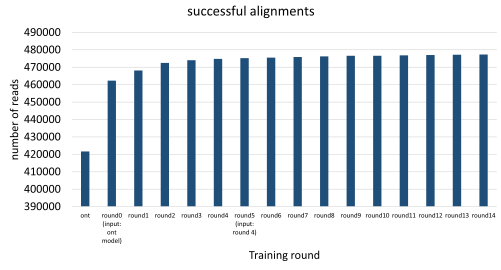
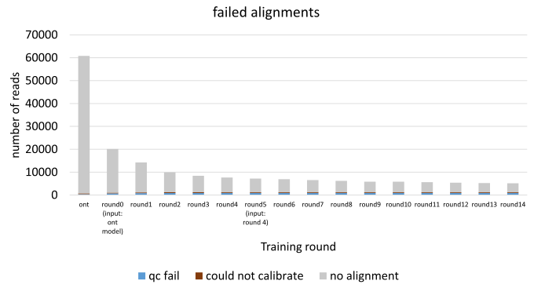
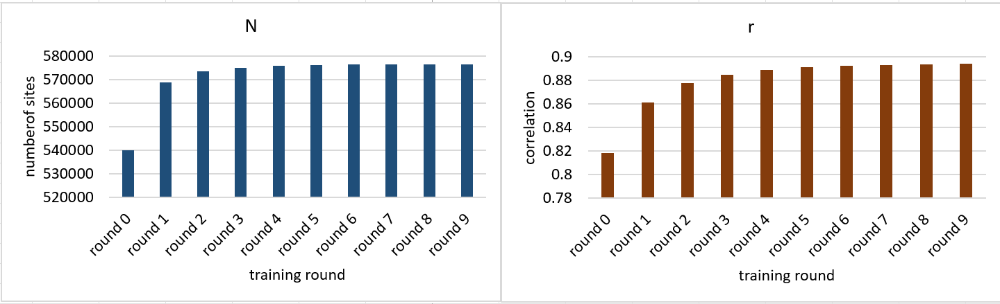
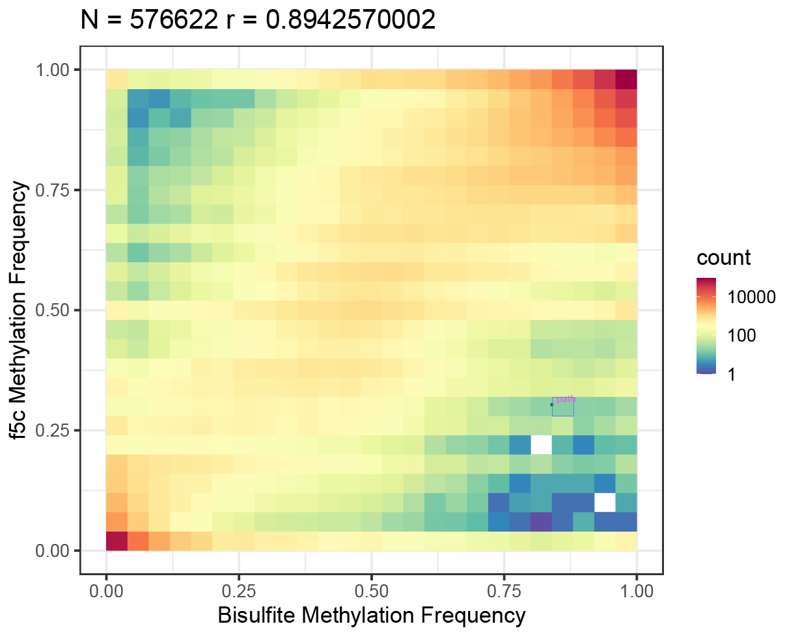

# Training new models for f5c using Nanopolish train

We Wanted to train new models for R10.4.1 for use with f5c. f5c has no implementation for training new models. Given f5c relies on nanopolish models, we use nanopolish for training models. The process of figuring out the nanopolish training for R10.4.1 was quite challenging and required considerable effort. With great help from [Jared Simpon](https://github.com/jts), we were able to figure. Hence, we have briefly documented the process we used to train R10.4.1 with nanopolish, and hope it can benefit someone else.

We sequenced the human methylated and non-methylated dataset from https://zymoresearch.eu/pages/dna-methylation-standards. The non-methylated data is used for training neucleotide model. Both methylated and nonmethylated are needed for training a methylation model in CpG context.

In this example, We will be using BLOW5 files to train as it is much faster and convienient to use. You can get the nanopolish r10 branch with BLOW5 support from https://github.com/hiruna72/nanopolish (the commit used: ce29c2dadb245857ad4a86a33b60724d2f312ca4) and compile it. The binary compiled on Ubuntu 16 is available under `slow5-nanopolish-train/` [here](https://f5c.page.link/r10train) and will work if your Linux distribution is recent.

# Nucleotide model

1. The base-model provided by ONT for dna_r10.4.1_e8.2_400bps was used as the base model (available: https://github.com/nanoporetech/kmer_models). The current level values in the ONT model are normalised. We convert to nanopolish model format as below (file `r10.4.1_400bps.nucleotide.9mer.model` available  [here](https://f5c.page.link/r10train)):

```
#ont_model_name r10_180mv_450bps_9mer
#kit    r10_450bps
#strand template
#k      9
#alphabet       nucleotide
kmer	level_mean	level_stdv	sd_mean	sd_stdv	weight
AAAAAAAAA	54.2049064106214	3.0	1	1	1	1
AAAAAAAAC	58.590797271313	3.0	1	1	1	1
AAAAAAAAG	55.9520679998075	3.0	1	1	1	1
AAAAAAAAT	58.4335200897368	3.0	1	1	1	1
AAAAAAACA	63.6599592820753	3.0	1	1	1	1
```

Though are training a model for dna_r10.4.1_e8.2_400bps, note that in the model above we have r10_180mv_450bps_9mer as the model, to trick nanopolish train to work. For converting the levels from ONT model to pA abive, we used `level*23.027081308793+96.631070539403`. Note that level_stdv is set to 3.0 for all kmers to start with. Other columns such as sd_mena are unsused, so leave them as 1.


2. Assume we have the nonmethylated dataset in a [BLOW file](https://github.com/hasindu2008/slow5tools) called `nonmeth_reads.blow5`. Basecall the BLOW5 file with super accuracy through [buttery-eel](https://github.com/Psy-Fer/buttery-eel) using Guppy:
```
buttery-eel  -g /install/ont-guppy-6.4.2/bin/  --config dna_r10.4.1_e8.2_400bps_sup.cfg  --device 'cuda:all' -i  nonmeth_reads.blow5 -q 10 -o  nonmeth.fastq --port 5555
```
This will create two files named `nonmeth.pass.fastq` and `nonmeth.fail.fastq`. We will be using  `nonmeth.pass.fastq` that contains passed reads (reads with mean qscore > 10).

3. Now let us use Minimap2 to map. We Used [hg38 with no alternate contigs](bit.ly/hg38noAlt) as the reference:
```
minimap2 -ax map-ont /genome/hg38noAlt.fa --secondary=no -t20 nonmeth.pass.fastq | samtools sort - > nonmeth_pass.bam
samtools index nonmeth_pass.bam
```
4. Before running nanopolish train, we need to replaces the few 'M' IUPAC bases in the hg38noAlt.fa with 'N' bases. Otherwise Nanopolish will error out as 'M' is the symbol used to represent methylated bases in nanopolish. Assume that patched reference is named `hg38noAlt_M_replaced_N.fa` and the compressed version named `hg38noAlt_M_replaced_N.fa.gz` can be download from [here](https://f5c.page.link/r10train). Now let us do the training.
```
slow5-nanopolish-train/nanopolish index  nonmeth.pass.fastq --slow5 nonmeth_reads.blow5
slow5-nanopolish-train/nanopolish train -r nonmeth.pass.fastq -g hg38noAlt_M_replaced_N.fa -b nonmeth_pass.bam  -t 72 --train-kmers=all --input-model-filename ./r10.4.1_400bps.nucleotide.9mer.model -d trained_nuc_models/
```

if training is successful, you should see files like `r10_450bps.nucleotide.9mer.template.roundX.model` under `trained_nuc_models` (they are uploaded [here](https://f5c.page.link/r10train)). They should look like:
```
#model_name	r10_450bps.nucleotide.9mer.template.model
#kit	r10_450bps
#strand	template
#alphabet	nucleotide
AAAAAAAAA	54.2003	1.99094	1	1
AAAAAAAAC	57.2213	2.59858	1	1
AAAAAAAAG	55.7136	2.52011	1	1
AAAAAAAAT	57.2297	2.71002	1	1
```

Also there will files like `r10_450bps.nucleotide.9mer.template.roundX.summmary.tsv`. Make sure in those files, the "is_trained" coulumn is set to 1:
```
model_short_name	kmer	num_matches	num_skips	num_stays	num_events_for_training	was_trained	trained_level_mean	trained_level_stdv
r10_450bps.t	CAAAAAAAA	0	0	0	1000	1	56.42	1.82
r10_450bps.t	TTCAAAAAA	0	0	0	1000	1	60.69	2.46
r10_450bps.t	AATAAAAAA	0	0	0	1000	1	57.26	3.36
r10_450bps.t	CCTAAAAAA	0	0	0	1000	1	60.58	2.35
r10_450bps.t	AAAAAAAAA	0	0	0	1000	1	54.20	1.99
```
If all of them are 0, that means they were not successfully trained. By default, nanopolish will require at least 100 num_events_for_training, so unless you have good coverage for all k-mers, some of the k-mers will not be trained. In our case, majority of the k-mers were trained.

If the outputs are empty or if all k-mers are not trained (happened to us at the beginning), it could be due to multiple reasons. I do not remeber much of those now, but these issues may help debugging: https://github.com/jts/nanopolish/issues/825, https://github.com/jts/nanopolish/issues/761,  https://github.com/jts/nanopolish/issues/1059, https://github.com/jts/nanopolish/issues/1064.


5. Then we used the last model trained in step 4 above (`trained_nuc_models/r10_450bps.nucleotide.9mer.template.round4.model`) as the input to train 10 more rounds.
```
slow5-nanopolish-train/nanopolish train -r nometh.pass.fastq -g hg38noAlt_M_replaced_N.fa -b nometh_pass.bam -t 72 --train-kmers=all --input-model-filename trained_nuc_models/r10_450bps.nucleotide.9mer.template.round4.model -d 
trained_nuc_models_more/ --rounds 10
```

The created model called `trained_nuc_models_more/r10_450bps.nucleotide.9mer.template.round9.model` (they are uploaded [here](https://f5c.page.link/r10train)) which looked like below is the final model that I put as the inbuilt model for f5c-v1.2-beta:
```
#model_name	r10_450bps.nucleotide.9mer.template.model
#kit	r10_450bps
#strand	template
#alphabet	nucleotide
AAAAAAAAA	53.9989	3.83325	1	1
AAAAAAAAC	55.769	3.20809	1	1
AAAAAAAAG	56.4699	5.17555	1	1
AAAAAAAAT	56.385	3.47242	1	1
AAAAAAACA	59.1981	4.42718	1	1
AAAAAAACC	62.2545	5.09254	1	1
AAAAAAACG	60.252	4.37649	1	1
AAAAAAACT	62.0946	4.71852	1	1
AAAAAAAGA	89.6554	29.6328	1	1
AAAAAAAGC	63.4326	4.10237	1	1
AAAAAAAGG	59.7029	4.50327	1	1
AAAAAAAGT	62.8706	3.91294	1	1
```

6. To determine how training went, I used f5c eventalign to align a set of hg2 reads (BLOW5 file available [here](https://slow5.page.link/na12878_prom_sub_slow5)) using the model file created after each training round. An example command that uses the last training round model:

```
f5c eventalign -x hpc-low -b hg2_subsample_guppy_6.4.2_hac_pass.bam -r hg2_subsample_guppy_6.4.2_hac_pass.fastq  -g /genome/hg38noAlt.fa  --slow5 hg2_subsample.blow5 --kmer-model trained_nuc_models_more/r10_450bps.nucleotide.9mer.template.round9.model > event.tsv 
```

At the end, f5c prints some alignment stats to the standard error:
```
total entries: 482419, qc fail: 900, could not calibrate: 318, no alignment: 3924, bad reads: 0
```

Plots below show how each training round improved the number of successful alignments and reduced the number of failed alignments (failed alignments = qc fail + could not calibrate + no alignment; successful alignments = total entries - failed alignments).

 


# Methylation model

1. We need both non-methylated data (used for nucleotide model training above) and methylated data for training a model for methylation calling. We already basecalled  the non-methylated data at step 1 [above](#nucleotide-model). Now let us basecall the methylated dataset.
```
buttery-eel  -g /install/ont-guppy-6.4.2/bin/  --config dna_r10.4.1_e8.2_400bps_sup.cfg  --device 'cuda:all' -i  meth_reads.blow5 -q 10 -o  meth.fastq --port 5555

```
2. Now combined passed reads from the non-methylated dataset and the methylated dataset into one single fastq file.
```
cat nonmeth.pass.fastq meth.pass.fastq > positive_and_negative_pass.fastq

```
3. Merge the methylated and non methylated BLOW5 files into one single file:
```
slow5tools merge meth_reads.blow5 nonmeth_reads.blow5 -o merged.blow5
```

4. Now we need to create a methylated reference - one with all CGs changed into MG. For this, we use the `hg38noAlt_M_replaced_N.fa` we created in step 4 [above](#nucleotide-model).

```
# make a copy with chr renamed to chr_meth
sed 's/chr/chr_meth_/g' hg38noAlt_M_replaced_N.fa > hg38noAlt_chr_renamed_to_meth.fa
# use seqtk to create single lined FASTA and replace all CG sites with MG.  
seqtk  seq -l0 hg38noAlt_chr_renamed_to_meth.fa | sed 's/CG/MG/g'  > hg38noAlt_chr_renamed_to_meth_methylated_cpg.fa
```
M is the nanopolish symbol for methylated bases. The boundaries (C'\n'G) will not be properly replaced if you use a multiline FASTA, that is why seqtk is used above to make it a single lined FASTA. 

5. Map the methylated reads to the renamed reference `hg38noAlt_chr_renamed_to_meth.fa` we created in the previous step above (not the `hg38noAlt_chr_renamed_to_meth_methylated_cpg.fa`)

```
minimap2 -ax map-ont hg38noAlt_chr_renamed_to_meth.fa--secondary=no -t20 meth.pass.fastq | samtools sort - > meth_pass.bam
samtools index meth_pass.bam
```

6. Merge the BAM file from non-methylated data (`nonmeth_pass.bam` we created before for in step 3 [above](#nucleotide-model)) and the BAM file from methylated  data (`meth_pass.bam`) into a single BAM file.
```
samtools merge merged.bam nonmeth_pass.bam meth_pass.bam 
samtools index merged.bam
```

7. Now create the hybrid reference to be later used with nanopolish.
```
seqtk  seq -l0 hg38noAlt_M_replaced_N.fa > hg38noAlt_tmp.fa
cat hg38noAlt_tmp.fa hg38noAlt_chr_renamed_to_meth_methylated_cpg.fa > hg38noAlt_hybrid.fa
```

8. Now we need to create a base methylated model for nanopolish. What we did was, we took the `r10_450bps.nucleotide.9mer.template.round9.model` nucleotide model which was trained above, created a new model with 'M' in the alphabet and put the same level_mean and level_stdv as for the corresponding 'C' counterparts. This file is named as `r10.4.1_400bps.cpg.9mer.model` which is available [here](https://f5c.page.link/r10train).
```
#model_name r10_450bps.cpg.9mer.template.model
#kit    r10_450bps
#strand template
#k      9
#alphabet       cpg
kmer	level_mean	level_stdv	sd_mean	sd_stdv	weight
AAAAAAAAA	53.998900	3.833250	1	1	1	1
AAAAAAAAC	55.769000	3.208090	1	1	1	1
AAAAAAAAG	56.469900	5.175550	1	1	1	1
AAAAAAAAM	55.769000	3.208090	1	1	1	1
AAAAAAAAT	56.385000	3.472420	1	1	1	1
AAAAAAACA	59.198100	4.427180	1	1	1	1
AAAAAAACC	62.254500	5.092540	1	1	1	1
AAAAAAACG	60.252000	4.376490	1	1	1	1
AAAAAAACM	62.254500	5.092540	1	1	1	1
AAAAAAACT	62.094600	4.718520	1	1	1	1
AAAAAAAGA	89.655400	29.632800	1	1	1	1
AAAAAAAGC	63.432600	4.102370	1	1	1	1
AAAAAAAGG	59.702900	4.503270	1	1	1	1
AAAAAAAGM	63.432600	4.102370	1	1	1	1
AAAAAAAGT	62.870600	3.912940	1	1	1	1
AAAAAAAMA	59.198100	4.427180	1	1	1	1
AAAAAAAMC	62.254500	5.092540	1	1	1	1
AAAAAAAMG	60.252000	4.376490	1	1	1	1
AAAAAAAMM	62.254500	5.092540	1	1	1	1
AAAAAAAMT	62.094600	4.718520	1	1	1	1
AAAAAAATA	58.516100	4.245120	1	1	1	1
AAAAAAATC	60.291300	4.159900	1	1	1	1
AAAAAAATG	60.182800	4.553570	1	1	1	1
AAAAAAATM	60.291300	4.159900	1	1	1	1
AAAAAAATT	59.724500	3.398340	1	1	1	1
AAAAAACAA	101.404000	18.021500	1	1	1	1
AAAAAACAC	108.078000	12.647600	1	1	1	1
AAAAAACAG	100.971000	18.010800	1	1	1	1
AAAAAACAM	108.078000	12.647600	1	1	1	1
AAAAAACAT	107.755000	11.699300	1	1	1	1
AAAAAACCA	101.966000	20.410900	1	1	1	1
AAAAAACCC	109.189000	13.997700	1	1	1	1
```

9. Now let us use nanopolish to train a methylation model. 
```
slow5-nanopolish-train/nanopolish index  positive_and_negative_pass.fastq --slow5 merged.blow5
slow5-nanopolish-train/nanopolish train -r positive_and_negative_pass.fastq -g hg38noAlt_hybrid.fa -b merged.bam  -t 72 --train-kmers=all --input-model-filename r10.4.1_400bps.cpg.9mer.model -d trained_meth_models --rounds 10
```

10. The created  `trained_meth_models/r10_450bps.cpg.9mer.template.round9.model` (available for download [here](https://f5c.page.link/r10train)) looked like below :
```
#model_name	r10_450bps.cpg.9mer.template.model
#kit	r10_450bps
#strand	template
#alphabet	cpg
AAAAAAAAA	53.7537	3.65572	1	1
AAAAAAAAC	56.2305	4.32346	1	1
AAAAAAAAG	57.3002	5.67074	1	1
AAAAAAAAM	62.9934	8.11058	1	1
AAAAAAAAT	56.7203	4.17047	1	1
AAAAAAACA	58.8781	4.15414	1	1
AAAAAAACC	62.5381	5.1778	1	1
AAAAAAACG	60.3428	5.31056	1	1
AAAAAAACM	63.1525	4.73173	1	1
AAAAAAACT	61.8409	4.19311	1	1
AAAAAAAGA	92.1803	31.218	1	1
AAAAAAAGC	63.5452	4.65351	1	1
AAAAAAAGG	61.4242	5.45205	1	1
AAAAAAAGM	68.0082	6.17807	1	1
AAAAAAAGT	62.7944	4.12666	1	1
AAAAAAAMA	59.1981	4.42718	1	1
AAAAAAAMC	62.2545	5.09254	1	1
AAAAAAAMG	61.1943	3.33436	1	1
AAAAAAAMM	62.2545	5.09254	1	1
AAAAAAAMT	62.0946	4.71852	1	1
AAAAAAATA	58.8587	4.67559	1	1
AAAAAAATC	60.3588	4.00821	1	1
AAAAAAATG	60.477	5.42577	1	1
AAAAAAATM	61.3608	3.74302	1	1
AAAAAAATT	59.6004	3.20899	1	1
AAAAAACAA	99.7551	17.5451	1	1
AAAAAACAC	107.298	12.0526	1	1
AAAAAACAG	101.281	17.5249	1	1
AAAAAACAM	109.249	13.1459	1	1
AAAAAACAT	107.25	11.8888	1	1
```

Make sure that `r10_450bps.cpg.9mer.template.round9.summmary.tsv` has the column "was_trained" set to 1 for k-mers with CG and MG. If the outputs are empty or if all k-mers are not trained (happened to us at the beginning), it could be due to multiple reasons.  I had to manually replace the inbuilt .inl model in nanopolish with values from the trained nucletide model `trained_nuc_models_more/r10_450bps.nucleotide.9mer.template.round9.model` (https://github.com/hiruna72/nanopolish/commit/5c7d01372abaef2aa2de9fde7227b1b09d34ea88).  If you are using the latest r10 branch from https://github.com/hiruna72/nanopolish/ or the binary download from [here](https://f5c.page.link/r10train) this is already done for you. 
These issues may help debugging if you are having troubles: https://github.com/jts/nanopolish/issues/825, https://github.com/jts/nanopolish/issues/761,  https://github.com/jts/nanopolish/issues/1059, https://github.com/jts/nanopolish/issues/1064.


11. To see how the training went, I used f5c call-methylation with trained methylation models from each round. For this I used a ~30X chr22 HG2 dataset.

```
f5c call-methylation -x hpc-low -b hg2_prom_lsk114/chr22/hac/reads.bam  -r hg2_prom_lsk114/chr22/hac/reads.fastq  -g /genome/hg38noAlt.fa --slow5 hg2_prom_lsk114/chr22/PGXX22394_reads_chr22.blow5  --kmer-model trained_nuc_models_more/r10_450bps.nucleotide.9mer.template.round9.model --meth-model trained_meth_models/r10_450bps.cpg.9mer.template.round9.model > meth.tsv
f5c meth-freq -i meth.tsv -s > meth-freq.tsv
```

Then I used the methylation comparison method described [here](https://nanopolish.readthedocs.io/en/latest/quickstart_call_methylation.html). For your convience, I have put the necessary scripts and the data to be downloaded under `eval/meth/` from [here](https://f5c.page.link/r10train).

```
 echo -e "chromosome\tstart\tend\tnum_motifs_in_group\tcalled_sites\tcalled_sites_methylated\tmethylated_frequency\tgroup" > meth-freqchr22.tsv
grep chr22 meth-freq.tsv >> meth-freqchr22.tsv
python3 eval/meth/compare_methylation.py eval/meth/chr22.tsv meth-freqchr22.tsv > bul_vs_f5c.tsv
R --save < eval/meth/plot_methylation.R
```

The data `eval/meth/chr22.tsv` is bisulphite data for chr22 of HG2 curated from [here](https://labs.epi2me.io/gm24385-5mc/). How the called number of sites (N) and correlation (r) change with each training round are as below:



The correlation plot from `trained_meth_models/r10_450bps.cpg.9mer.template.round9.model` is as follows:



The `trained_meth_models/r10_450bps.cpg.9mer.template.round9.model` was used as the inbuilt model for f5c-v1.2-beta. 
 
___

As we used minimal data to train (the coverage for human methylated and non-methylated dataset was pretty low), the models are not perfect. Some k-mers did not even have enough coverage to train. But the good thing is, now anyone who has better data can use the models we generated as the base models (`trained_nuc_models_more/r10_450bps.nucleotide.9mer.template.round9.model` as the base nucleotide model and `trained_meth_models/r10_450bps.cpg.9mer.template.round9.model` as the base methylation model) and train futher.


